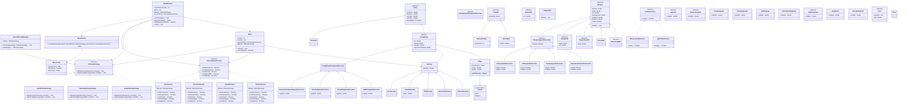

```mermaid
classDiagram
    %% Abstract Classes

    class DifficultyStrategy {
        <<interface>>
        + adjustEnemyStats(enemy: Ennemy) : void
        + adjustPickableDrop(pickable: Pickable) : void
    }

    class EasyDifficultyStrategy {
        + adjustEnemyStats(enemy: Ennemy) : void
        + adjustPickableDrop(pickable: Pickable) : void
    }

    class MediumDifficultyStrategy {
        + adjustEnemyStats(enemy: Ennemy) : void
        + adjustPickableDrop(pickable: Pickable) : void
    }

    class HardDifficultyStrategy {
        + adjustEnemyStats(enemy: Ennemy) : void
        + adjustPickableDrop(pickable: Pickable) : void
    }

    class GameDifficultyManager {
        - strategy : DifficultyStrategy
        + setStrategy(strategy : DifficultyStrategy) : void
        + getStrategy() : DifficultyStrategy
    }

    GameDifficultyManager --> DifficultyStrategy
    DifficultyStrategy <|.. EasyDifficultyStrategy
    DifficultyStrategy <|.. MediumDifficultyStrategy
    DifficultyStrategy <|.. HardDifficultyStrategy

    class Wave {
        - number : int
        - enemies : List<Ennemy>
        - specieFactory : EnnemySpecieFactory
        - difficulty : DifficultyStrategy

        + spawn() : void
        + isCompleted() : boolean
    }

    class WaveConfig {
        - enemyCounts : Map<String, Integer>
        - isBossWave : boolean
        - specieType : String
    }

    class WaveManager {
        - currentWaveNumber : int
        - waves : List<Wave>
        - difficulty : DifficultyStrategy
        - specieFactory : EnnemySpecieFactory

        + startNextWave() : void
        + getCurrentWave() : Wave
        + isAllWavesCompleted() : boolean
        + reset() : void
    }

    class WaveFactory {
        + createWave(config: WaveConfig, difficulty: DifficultyStrategy, specieFactory: EnnemySpecieFactory) : Wave
    }

    %% Relationships
    WaveManager --> Wave
    Wave --> Ennemy
    Wave --> EnnemySpecieFactory
    Wave --> DifficultyStrategy
    WaveManager --> DifficultyStrategy
    WaveManager --> EnnemySpecieFactory
    WaveManager --> WaveFactory
    WaveFactory --> WaveConfig


    class Entity {
        <<abstract>>
        - positionX : double
        - positionY : double
        - velocityX : double
        - velocityY : double
        - BoudingBox: Rectangle
    }

    class Projectile {
    }

    class LivingEntity {
        <<abstract>>
        - hp : double
        - hpMax: double
        - strength : double
        - regenerationSpeed: double
    }

    class LivingEntityStatsUpgradeDecorator {
        <<abstract>>
    }

    class HpMaxUpgradeDecorator {
        multiplier: double
    }

    class VelocityUpgradeDecorator {
        multiplier: double
    }

    class StrengthUpgradeDecorator {
        multiplier: double
    }

    class RegenerationSpeedUpgradeDecorator {
        multiplier: double
    }

    class Player {
        - pseudoname : String
        - money : double
        - gender : Gender
        __+ getInstance() : Player__
    }


    %% Enum
    class Gender {
        <<enumeration>>
        MALE
        FEMALE
    }

    %% Enemy Hierarchy
    class Ennemy {
        - damage : double
    }

    class CommonEnnemy {
    }

    class SpeedsterEnnemy {
    }

    class TankEnnemy {
    }

    class RangedEnnemy {
        - range : double
    }

    class BossEnnemy {
    }

    %% Factory Interface
    class EnnemySpecieFactory {
        <<interface>>
        + createCommon() : Ennemy
        + createSpeedster() : Ennemy
        + createTank() : Ennemy
        + createRanged() : Ennemy
        + createBoss() : Ennemy
    }

    %% Concrete Factories
    class VampireFactory {
        difficulty: DifficultyStrategy

        + createCommon() : Ennemy
        + createSpeedster() : Ennemy
        + createTank() : Ennemy
        + createRanged() : Ennemy
        + createBoss() : Ennemy
    }

    class ZombieFactory {
        difficulty: DifficultyStrategy

        + createCommon() : Ennemy
        + createSpeedster() : Ennemy
        + createTank() : Ennemy
        + createRanged() : Ennemy
        + createBoss() : Ennemy
    }

    class AmericanFactory {
        difficulty: DifficultyStrategy

        + createCommon() : Ennemy
        + createSpeedster() : Ennemy
        + createTank() : Ennemy
        + createRanged() : Ennemy
        + createBoss() : Ennemy
    }

    class AlienFactory {
        difficulty: DifficultyStrategy

        + createCommon() : Ennemy
        + createSpeedster() : Ennemy
        + createTank() : Ennemy
        + createRanged() : Ennemy
        + createBoss() : Ennemy
    }

    class Weapon {
        <<abstract>>
        -damage: double
        -range: double
        -aoe: double
        -attackSpeeed: double
        -positionX: double
        -positionY: double
        -rotation: double

        +attack() : void
    }

    class WeaponUpgradeDecorator {
        <<abstract>>
        wrappee: Weapon
    }

    class AttackSpeedUpgradeDecorator{
        wrapee: Weapon
        multiplier: double
    }

    class DamageUpgradeDecorator{
        wrapee: Weapon
        multiplier: double
    }

    class AOEUpgradeDecorator{
        wrapee: Weapon
        multiplier: double
    }

    class RangeUpgradeDecorator {
        wrapee: Weapon
        multiplier: double
    }

    class MeleeSingleHit {
        <<abstract>>
    }

    class MeleeAOE {
        <<abstract>>
        -aoe: double
    }

    class RangeSingleHit {
        <<abstract>>
        -range: double
    }

    class RangeAOE {
        <<abstract>>
        -range: double
        -aoe: double
    }

    class WeaponSlot {
        
        +attack(): void
    }

    class Pickable {
        <<abstract>>
        -probability: double
    }

    class HpPickable {
        -hpGain: double;
    }

    class MoneyPickable {
        -moneyGain: int
    }

    class PickableFactory {
        <<interface>>
        +create(): Pickable
    }

    class HpPickableFactory {
        
        +create(): Pickable
    }

    class MoneyPickableFactory {

        +create(): Pickable
    }

    class Upgrade {
        <<abstract>>
        - multiplier : double
    }

    class WeaponUpgrade {
        <<abstract>>
        - multiplier : double
    }

    class RangeUpgrade {
        - multiplier : double
    }

    class DamageUpgrade {
        - multiplier : double
    }

    class AOEUpgrage {
        - multiplier : double
    }

    class AttackSpeedUpgrade {
        - multiplier : double
    }

    class PlayerUpgrade {
        <<abstract>>
        - multiplier : double
    }

    class HpUpgrade {
        - multiplier : double
    }

    class StrenghtUpgrade{
        - mutiplier : double
    }

    class Item {
        <<abstract>>
        - upgrades : List<Upgrade>
        - price: double
    }

    clqss

    class Shop {

    }

    %% Inheritances
    Entity <|-- LivingEntity
    Entity <|-- Projectile
    LivingEntity <|-- Player
    LivingEntity <|-- Ennemy
    LivingEntity <|-- LivingEntityStatUpgradeDecorator
    LivingEntityStatUpgradeDecorator <|-- HpMaxUpgradeDecorator
    LivingEntityStatUpgradeDecorator <|-- StrengthUpgradeDecorator
    LivingEntityStatUpgradeDecorator <|-- VelocityUpgradeDecorator
    LivingEntityStatUpgradeDecorator <|-- RegenerationSpeedUpgradeDecorator

    Weapon <|-- MeleeSingleHit
    Weapon <|-- MeleeAEO
    Weapon <|-- RangeSingleHit
    Weapon <|-- RangeAOE
    Pickable <|-- HpPickable
    Pickable <|-- MoneyPickable
    Weapon <|-- WeaponUpgradeDecorator
    WeaponUpgradeDecorator <|-- AttackSpeedUpgradeDecorator
    WeaponUpgradeDecorator <|-- DamageUpgradeDecorator
    WeaponUpgradeDecorator <|-- AOEUpgradeDecorator
    WeaponUpgradeDecorator <|-- RangeUpgradeDecorator

    Ennemy <|-- CommonEnnemy
    Ennemy <|-- SpeedsterEnnemy
    Ennemy <|-- TankEnnemy
    Ennemy <|-- RangedEnnemy
    Ennemy <|-- BossEnnemy

    %% Enum association
    Player --> Gender

    %% Factory interface implementations
    EnnemySpecieFactory <|.. VampireFactory
    EnnemySpecieFactory <|.. ZombieFactory
    EnnemySpecieFactory <|.. AmericanFactory
    EnnemySpecieFactory <|.. AlienFactory
    PickableFactory <|.. HpPickableFactory
    PickableFactory <|.. MoneyPickableFactory
```