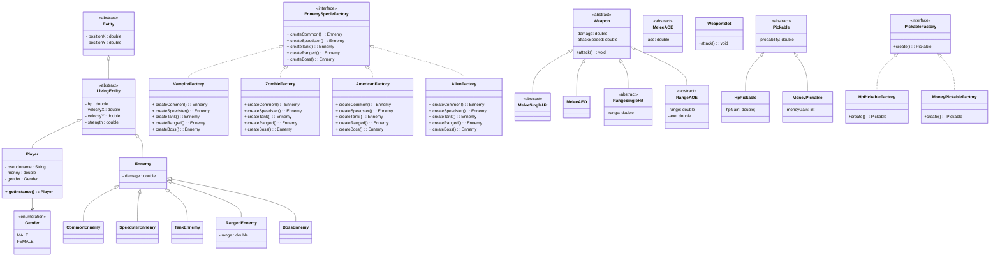

```mermaid
classDiagram
    %% Abstract Classes
    class Entity {
        <<abstract>>
        - positionX : double
        - positionY : double
    }

    class LivingEntity {
        <<abstract>>
        - hp : double
        - velocityX : double
        - velocityY : double
        - strength : double
    }

    class Player {
        - pseudoname : String
        - money : double
        - gender : Gender
        __+ getInstance() : Player__
    }

    %% Enum
    class Gender {
        <<enumeration>>
        MALE
        FEMALE
    }

    %% Enemy Hierarchy
    class Ennemy {
        - damage : double
    }

    class CommonEnnemy {
    }

    class SpeedsterEnnemy {
    }

    class TankEnnemy {
    }

    class RangedEnnemy {
        - range : double
    }

    class BossEnnemy {
    }

    %% Factory Interface
    class EnnemySpecieFactory {
        <<interface>>
        + createCommon() : Ennemy
        + createSpeedster() : Ennemy
        + createTank() : Ennemy
        + createRanged() : Ennemy
        + createBoss() : Ennemy
    }

    %% Concrete Factories
    class VampireFactory {
        + createCommon() : Ennemy
        + createSpeedster() : Ennemy
        + createTank() : Ennemy
        + createRanged() : Ennemy
        + createBoss() : Ennemy
    }

    class ZombieFactory {
        + createCommon() : Ennemy
        + createSpeedster() : Ennemy
        + createTank() : Ennemy
        + createRanged() : Ennemy
        + createBoss() : Ennemy
    }

    class AmericanFactory {
        + createCommon() : Ennemy
        + createSpeedster() : Ennemy
        + createTank() : Ennemy
        + createRanged() : Ennemy
        + createBoss() : Ennemy
    }

    class AlienFactory {
        + createCommon() : Ennemy
        + createSpeedster() : Ennemy
        + createTank() : Ennemy
        + createRanged() : Ennemy
        + createBoss() : Ennemy
    }

    class Weapon {
        <<abstract>>
        -damage: double
        -attackSpeeed: double

        +attack() : void
    }

    class MeleeSingleHit {
        <<abstract>>
    }

    class MeleeAOE {
        <<abstract>>
        -aoe: double
    }

    class RangeSingleHit {
        <<abstract>>
        -range: double
    }

    class RangeAOE {
        <<abstract>>
        -range: double
        -aoe: double
    }

    class WeaponSlot {
        
        +attack(): void
    }

    class Pickable {
        <<abstract>>
        -probability: double
    }

    class HpPickable {
        -hpGain: double;
    }

    class MoneyPickable {
        -moneyGain: int
    }

    class PickableFactory {
        <<interface>>
        +create(): Pickable
    }

    class HpPickableFactory {
        
        +create(): Pickable
    }

    class MoneyPickableFactory {

        +create(): Pickable
    }

    %% Inheritances
    Entity <|-- LivingEntity
    LivingEntity <|-- Player
    LivingEntity <|-- Ennemy
    Weapon <|-- MeleeSingleHit
    Weapon <|-- MeleeAEO
    Weapon <|-- RangeSingleHit
    Weapon <|-- RangeAOE
    Pickable <|-- HpPickable
    Pickable <|-- MoneyPickable

    Ennemy <|-- CommonEnnemy
    Ennemy <|-- SpeedsterEnnemy
    Ennemy <|-- TankEnnemy
    Ennemy <|-- RangedEnnemy
    Ennemy <|-- BossEnnemy

    %% Enum association
    Player --> Gender

    %% Factory interface implementations
    EnnemySpecieFactory <|.. VampireFactory
    EnnemySpecieFactory <|.. ZombieFactory
    EnnemySpecieFactory <|.. AmericanFactory
    EnnemySpecieFactory <|.. AlienFactory
    PickableFactory <|.. HpPickableFactory
    PickableFactory <|.. MoneyPickableFactory
```